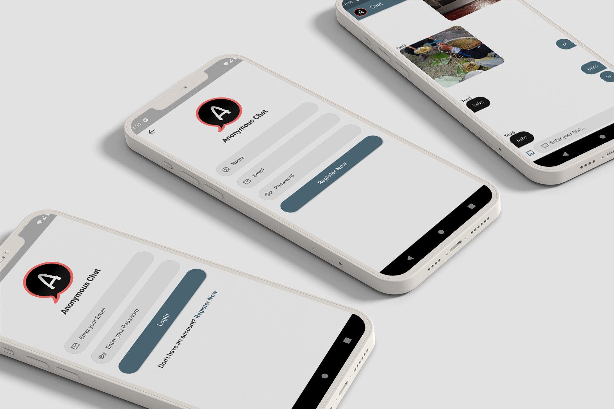
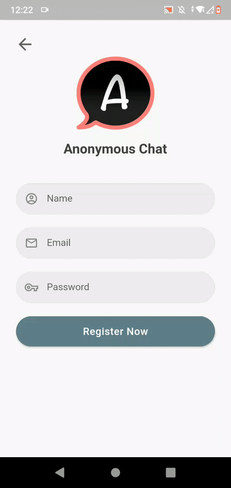
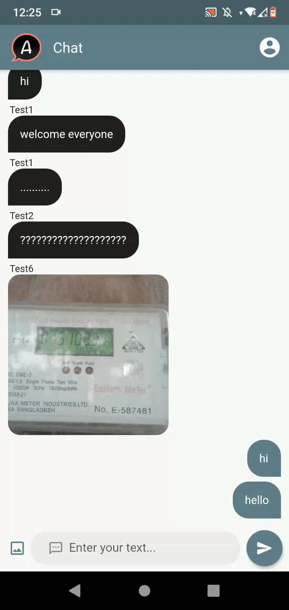
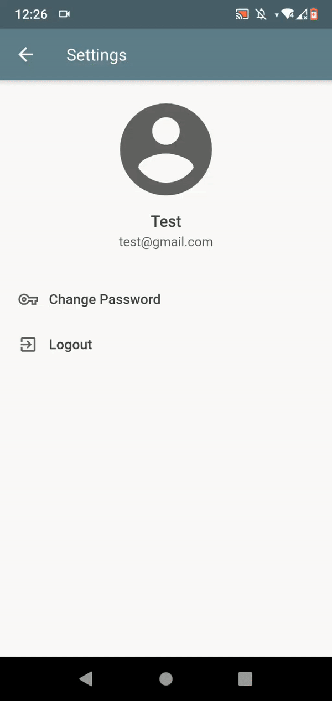
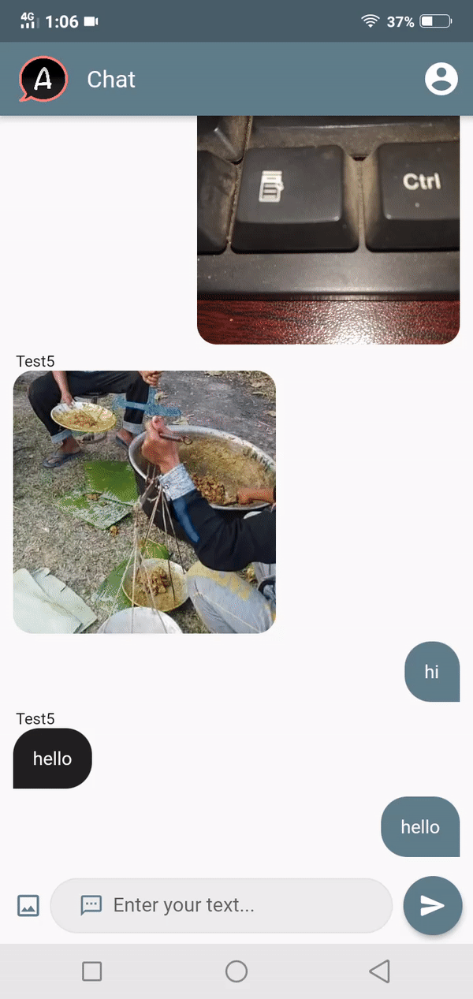
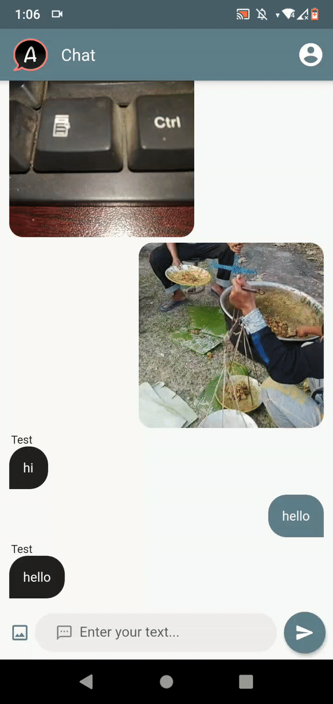
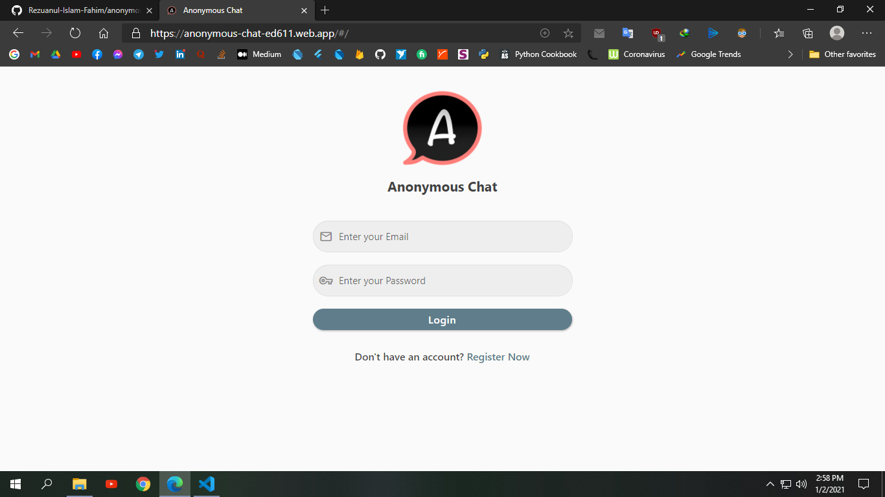

# Anonymous Chat

A simple chatting app for Android + IOS + Web made with dart and flutter.



<a href="https://drive.google.com/file/d/1cXccWis-IGNHAGkZHYmr5-zh3n_LuGue/view?usp=sharing"></a>

### Support this project

[](https://github.com/Rezuanul-Islam-Fahim/anonymous_chat/stargazers) [](https://github.com/Rezuanul-Islam-Fahim/anonymous_chat/network/members) [](https://github.com/Rezuanul-Islam-Fahim/anonymous_chat/watchers) [](https://github.com/Rezuanul-Islam-Fahim/anonymous_chat/blob/stable/LICENSE)

## Screenshots

     

### Realtime Chatting

 

### Web App



## Features

- Android/IOS/Web app support
- Realtime chatting support
- Loading animation
- Text & image message
- Form validation facility
- Facility for changing password
- Flush message on error/success
- Show splash screen when opening app
- Cross platform support
- Attractive design & UI
- Smooth scrolling & performance
- Power of dart and flutter
- Firebase backend
- Landscape mode support

`Note:` Sending image on web app is currently not supported.

## License

```
MIT License

Copyright (c) 2021 Rezuanul Islam Fahim

Permission is hereby granted, free of charge, to any person obtaining a copy
of this software and associated documentation files (the "Software"), to deal
in the Software without restriction, including without limitation the rights
to use, copy, modify, merge, publish, distribute, sublicense, and/or sell
copies of the Software, and to permit persons to whom the Software is
furnished to do so, subject to the following conditions:

The above copyright notice and this permission notice shall be included in all
copies or substantial portions of the Software.

THE SOFTWARE IS PROVIDED "AS IS", WITHOUT WARRANTY OF ANY KIND, EXPRESS OR
IMPLIED, INCLUDING BUT NOT LIMITED TO THE WARRANTIES OF MERCHANTABILITY,
FITNESS FOR A PARTICULAR PURPOSE AND NONINFRINGEMENT. IN NO EVENT SHALL THE
AUTHORS OR COPYRIGHT HOLDERS BE LIABLE FOR ANY CLAIM, DAMAGES OR OTHER
LIABILITY, WHETHER IN AN ACTION OF CONTRACT, TORT OR OTHERWISE, ARISING FROM,
OUT OF OR IN CONNECTION WITH THE SOFTWARE OR THE USE OR OTHER DEALINGS IN THE
SOFTWARE.
```